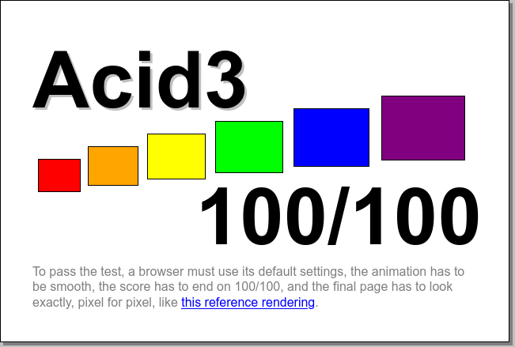

+++
title="Kick Off"
description="Funding acquired, time to get started!"
date=2023-04-05

[taxonomies]
tags = ["Q1", "funding"]
categories = ["status update"]
+++

## Introduction

Any denizen of the 2000s internet who dabbled in web development probably
remembers the [Acid3](http://acid3.acidtests.org/) browser testing website. The
six squares jittering slightly as they change color, never quite reaching the
rainbow from the reference image:

If you've been following the [AllWalletDevs](https://allwallet.dev)
meetings&mdash;and if you haven't been, you should be&mdash;you might be aware
that we've prototyped a framework for testing Ethereum wallets inspired by the
Acid3 tests. Our goal is to foster quality and consistency by making it
trivially easy to share tests across wallets.

This project is official now, with a one year grant from the Ethereum
Foundation's [Ecosystem Support Program](https://esp.ethereum.foundation/)!

## Project

The initial scope of the project is split into several milestones spaced out
over one year. After completing these milestones, the testing framework should
be in a reasonable place for outside contributors and be ready for wallets to
integrate.

### Milestones

1. Reassess [the prototype](https://github.com/Wallet-Test-Framework/framework),
   and get it into reasonable shape to form the foundation of the framework.
1. Happy-path coverage of all of the endpoints available in the
   [`execution-apis`](https://ethereum.github.io/execution-apis/api-documentation/)
   specification for a single wallet, where the website walks the user through
   the tests with specific human-readable instructions.
1. Expand the coverage to include multiple wallets, possibly including at least
   one browser extension and one hardware wallet.
1. Build automation glue (eg. [WebDriver](https://www.w3.org/TR/webdriver/)) for
   at least one wallet.

### Architecture

#### Overview

#### Components

##### Proxy

A web server that forwards JSON-RPC requests between the wallet and the
simulated chain. Necessary because browsers do not allow web pages to listen for
HTTP or WebSocket connections.

##### Wallet

The software under test. Communicates with the tests using `window.ethereum`,
and with the simulated chain through the proxy with JSON-RPC.

##### Simulated Chain

An isolated Ethereum-compatible blockchain (like
[Ganache](https://github.com/trufflesuite/ganache).) The simulated chain
presents a JSON-RPC interface to the wallet through the proxy.

##### Tests
Collection of functions that put the simulated chain into a known state, then
perform some operation with or retrieve some information through the wallet.

##### Glue

Software specific to each wallet that translates conceptual actions (eg. approve
transaction) into a format that the wallet understands. Initially this will be
on-screen instructions for the user to follow, but later on the glue could be
implemented with, for example, WebDriver for browser-based wallets.

### What's Next?

You'll start to see some activity in the
[repository](https://github.com/Wallet-Test-Framework/framework) in the next
week or so, and perhaps some discussion in
[#testing](https://discord.gg/buZVvsAsAN).

If you're developing a wallet and want to contribute, please reach out to
[@gaudren_](https://twitter.com/gaudren_)!
